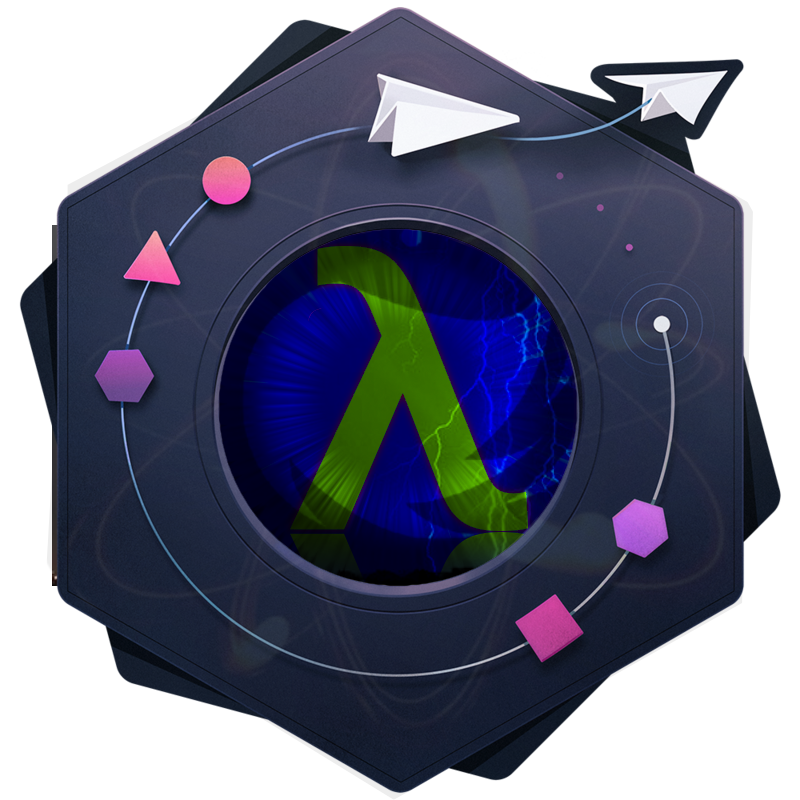

<div align="center">
  </img>
  <h1>ElasticDev Starter Kit</h1>
</div>

> _Elastic, Serverless, Universal... oh my! 💫_
>
> ESK is a toolkit for **universal**, **serverless**, **schema-first**, **immutable**,
> **reactive**, **functional** and **progressive** applications using
> **React & GraphQL as a platform** at its core.

[![Semantically Released][semantic-release-badge]][semantic-release]
[![Build Status][build-badge]][build]
[![Code Coverage][coverage-badge]][coverage]
[![version][version-badge]][package]
[![downloads][downloads-badge]][npmtrends]
[![Styled with Prettier][prettier-badge]][prettier]
[![AirBnB style guide][airbnb-style-badge]][airbnb-style]

[![MIT License][license-badge]][license]
[](#contributors)
[![PRs Welcome][prs-badge]][prs]
[![Commitizen friendly][commitizen-badge]][commitizen]
[![Code of Conduct][coc-badge]][coc]


[![Watch on GitHub][github-watch-badge]][github-watch]
[![Star on GitHub][github-star-badge]][github-star]
[![Tweet][twitter-badge]][twitter]

<!-- START doctoc generated TOC please keep comment here to allow auto update -->
<!-- DON'T EDIT THIS SECTION, INSTEAD RE-RUN doctoc TO UPDATE -->
# Table of Contents

- [Motivation](#motivation)
- [Features](#features)
- [Built With](#built-with)
- [Why you shouldn't use this](#why-you-shouldnt-use-this)
- [Docs](#docs)
  - [Configuration](#configuration)
  - [Deploying](#deploying)
  - [Examples](#examples)
  - [API Reference](#api-reference)
- [Developing](#developing)
  - [Prerequisites](#prerequisites)
  - [Setting up Dev](#setting-up-dev)
  - [Create an environment file](#create-an-environment-file)
  - [Start development](#start-development)
- [Versioning](#versioning)
- [Tests](#tests)
- [Style guide](#style-guide)
- [Licensing](#licensing)
- [Contributing](#contributing)
  - [Code of Conduct](#code-of-conduct)
- [Contributors](#contributors)

<!-- END doctoc generated TOC please keep comment here to allow auto update -->

## Motivation

A starter kit for quickly developing universal applications powered by React, GraphQL, functional,
serverless, and reactive concepts. Includes web, mobile and desktop platforms, with more to come.

ESK reduces boilerplate to the absolute minimum, and thrives to make application development
simpler by encapsulating common constructs, patterns, models and relationships common to most apps.

This "incidental" architecture that we build just in order to get our business feature
development going is minimized, letting you focus on the core values of your application.
Project setup and configuration, authentication, payments, search, social features, among others,
are handled for you and ready to be extended to accommodate your application requirements.

## Features

|                           | Core | Backend | UI  | Platform UI | Details                     | Docs      |
| ------------------------- | :--: | :-----: | :-: | :---------: | :-------------------------: | :-------: |
| 👤 Auth & Profile         |  ⏳  |   ⏳     | ⏳   |     ⏳      | Password, phone/SMS, OAuth2 | 📖         |
| 🔍 Search                 |  ⏳  |   ⏳     | ⏳   |     ⏳      | ...                         | 📖         |
| 💬 Chat & Online Presence |  ⏳  |   ⏳     | ⏳   |     ⏳      | ...                         | 📖         |
| 👯 Social                 |  ⏳  |   ⏳     | ⏳   |     ⏳      | ...                         | 📖         |
| ⚓ Navigation             |  ⏳  |   ⏳     | ⏳   |     ⏳      | ...                         | 📖         |
| 💰 Payments               |  ⏳  |   ⏳     | ⏳   |     ⏳      | ...                         | 📖         |
| ⚡ Realtime               |  ⏳  |   ⏳     | ⏳   |     ⏳      | ...                         | 📖         |
| 💥 Crash Free             |  ⏳  |   ⏳     | ⏳   |     ⏳      | ...                         | 📖         |
| 🔌 Offline                |  ⏳  |   ⏳     | ⏳   |     ⏳      | ...                         | 📖         |
| 🎨 Beautiful design       |  -   |   -     | -    |     ⏳      | ...                          | 📖        |
| 💄 Universal Styles       |  -   |   -     | ⏳   |     ⏳      | ...                          | 📖        |
| 🌎 Internationalization   |  -   |   -      | -   |     ⏳      | ...                          | 📖        |
| 📈 Analytics              |  -   |   -     | ⏳   |     ⏳      | ...                          | 📖        |

## Built With

* [React][react]
* [React Native][react-native]
* [NextJS][nextjs]
* [GraphQL][graphql]
* [Apollo Client][apollo]
* [Glamorous][glamorous]
* [React Primitives][react-primitives]
* [Electron][electron]
* [Ramda][ramda]
* [generator-bxd-oss][generator-bxd-oss]

TODO: List other main libraries, frameworks used including versions.

## Why you shouldn't use this

It's not common for projects to include an anti-pitch, but in the interest of transparency,
we thought it would help you evaluate whether to use (or contribute to) this project. You're always welcome to help, and we will be removing these points accordingly if we
feel we've made significant process and there are no longer relevant, we might be
adding some too.

* 🔥 This project is _really_ unstable and on the earliest phases you can think of.
* 💥 This project is _very_ ambitious, we might not complete everything there's to it ¯\_(ツ)\_/¯.
* 💦 This project is _very_ opinionated, a plugin architecture is in our roadmap, but
  for now the technology and pattern choices made will probably have to resonate with you
  in order to be used effectively.
* 👀 Tooling across the ecosystem is not there yet, so we have patches all over the place.
* 👎 If serverless isn't for you or your organization.
* 🙉 If you're not building universal apps.
* 😾 If you're looking for something simple. We'll simplify our API and usage when we're
  closing in on **1.0**.

## Docs

### Configuration

__TODO__

### Deploying

TODO: give more detailed instructions on how to build and release a new version
In case there's some step you have to take that publishes this project to a
server, this is the right time to state it.

### Examples

* TodoMVC

### API Reference

TODO: Link to deployed GraphQL playground, Documentation.js generated docs, etc.

## Developing

### Prerequisites

* Install [NodeJS][node].
* Install [Yarn][yarn].

### Setting up Dev

Here's a brief intro about what a developer must do in order to start developing
the project further:

```shell
git clone https://github.com/blackxored/elasticdev-starter-kit.git
cd elasticdev-starter-kit/
yarn
```

### Create an environment file

**TODO**

### Start development

```shell
yarn dev
```

## Versioning

We use [SemVer][semver] for versioning. In addition, it's automatic via
[semantic-release][semantic-release], and our [commit convention][commit-convention].

For the versions available, see the [Releases][releases] on this repository.

## Tests

```shell
yarn test
```

## Style guide

We use most of [AirBnB's style guide][airbnb-style] and we check with [ESLint][eslint]
and automatically format our code with [Prettier][prettier]

## Licensing

This project is licensed under the MIT License - see the 
[license] file for details.

## Contributing

If you're interested in contributing to this project in any form, please read
our [Contribution Guidelines][contributing].

### Code of Conduct

We've adopted a Code of Conduct that we expect project participants to adhere to.
Please read the [full text][coc] so that you can understand what actions will and will not be tolerated.

## Contributors

Thanks goes to these wonderful people ([emoji key](https://github.com/kentcdodds/all-contributors#emoji-key)):

<!-- ALL-CONTRIBUTORS-LIST:START - Do not remove or modify this section -->
<!-- prettier-ignore -->
| [<br /><sub><b>Adrian Perez</b></sub>](http://adrianperez.codes)<br />[💻](https://github.com/blackxored/elasticdev-starter-kit/commits?author=blackxored "Code") [📖](https://github.com/blackxored/elasticdev-starter-kit/commits?author=blackxored "Documentation") [🚇](#infra-blackxored "Infrastructure (Hosting, Build-Tools, etc)") [🎨](#design-blackxored "Design") [👀](#review-blackxored "Reviewed Pull Requests") [🤔](#ideas-blackxored "Ideas, Planning, & Feedback") |
| :---: |
<!-- ALL-CONTRIBUTORS-LIST:END -->

This project follows the [all-contributors](https://github.com/kentcdodds/all-contributors) specification. Contributions of any kind welcome!

[npm]: https://www.npmjs.com/
[node]: https://nodejs.org
[yarn]: https://yarnpkg.com/en/docs/install
[build-badge]: https://img.shields.io/travis/blackxored/elasticdev-starter-kit.svg?style=flat-square
[build]: https://travis-ci.org/blackxored/elasticdev-starter-kit
[coverage-badge]: https://img.shields.io/codecov/c/github/blackxored/elasticdev-starter-kit.svg?style=flat-square
[coverage]: https://codecov.io/github/blackxored/elasticdev-starter-kit
[version-badge]: https://img.shields.io/npm/v/elasticdev-starter-kit.svg?style=flat-square
[package]: https://www.npmjs.com/package/elasticdev-starter-kit
[downloads-badge]: https://img.shields.io/npm/dm/elasticdev-starter-kit.svg?style=flat-square
[npmtrends]: http://www.npmtrends.com/elasticdev-starter-kit
[license-badge]: https://img.shields.io/npm/l/elasticdev-starter-kit.svg?style=flat-square
[license]: https://github.com/blackxored/elasticdev-starter-kit/blob/master/LICENSE.md
[semantic-release]: https://github.com/semantic-release/semantic-release
[semantic-release-badge]: https://img.shields.io/badge/%20%20%F0%9F%93%A6%F0%9F%9A%80-semantic--release-e10079.svg?style=flat-square
[commitizen-badge]: https://img.shields.io/badge/commitizen-friendly-brightgreen.svg?style=flat-square
[commitizen]: http://commitizen.github.io/cz-cli/
[prettier-badge]: https://img.shields.io/badge/styled_with-prettier-ff69b4.svg?style=flat-square
[prettier]: https://github.com/prettier/prettier
[airbnb-style-badge]: https://img.shields.io/badge/code%20style-airbnb-green.svg?style=flat-square
[airbnb-style]: https://github.com/airbnb/javascript
[eslint]: http://eslint.org
[prs-badge]: https://img.shields.io/badge/PRs-welcome-brightgreen.svg?style=flat-square
[prs]: http://makeapullrequest.com
[donate-badge]: https://img.shields.io/badge/$-support-green.svg?style=flat-square
[contributing]: https://github.com/blackxored/elasticdev-starter-kit/blob/master/CONTRIBUTING.md
[coc-badge]: https://img.shields.io/badge/code%20of-conduct-ff69b4.svg?style=flat-square
[coc]: https://github.com/blackxored/elasticdev-starter-kit/blob/master/CODE_OF_CONDUCT.md
[github-watch-badge]: https://img.shields.io/github/watchers/blackxored/elasticdev-starter-kit.svg?style=social
[github-watch]: https://github.com/blackxored/elasticdev-starter-kit/watchers
[github-star-badge]: https://img.shields.io/github/stars/blackxored/elasticdev-starter-kit.svg?style=social
[github-star]: https://github.com/blackxored/elasticdev-starter-kit/stargazers
[twitter]: https://twitter.com/intent/tweet?text=Check%20out%20elasticdev-starter-kit%20by%20%40blackxored%20https%3A%2F%2Fgithub.com%2Fblackxored%2Fapollo-link-logger%20%F0%9F%91%8D
[twitter-badge]: https://img.shields.io/twitter/url/https/github.com/blackxored/elasticdev-starter-kit.svg?style=social
[emojis]: https://github.com/kentcdodds/all-contributors#emoji-key
[all-contributors]: https://github.com/kentcdodds/all-contributors
[semver]: http://semver.org/
[releases]: https://github.com/blackxored/elasticdev-starter-kit/releases
[commit-convention]: https://www.npmjs.com/package/@commitlint/config-conventional
[tags]: /tags
[react]: https://facebook.github.io/react
[react-native]: https://facebook.github.io/react-native
[nextjs]: https://github.com/zeit/next.js
[graphql]: http://graphql.org
[apollo]: http://dev.apollodata.com
[glamorous]: https://glamorous.rocks/
[react-primitives]: https://github.com/lelandrichardson/react-primitives
[electron]: https://electron.atom.io
[serverless]: https://serverless.com/
[ramda]: http://ramdajs.com
[generator-bxd-oss]: https://github.com/blackxored/generator-bxd-oss
